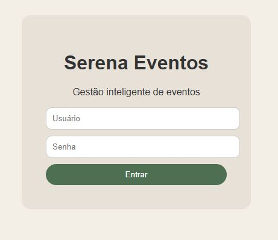
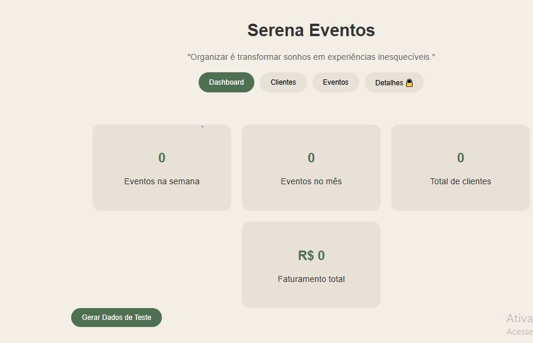
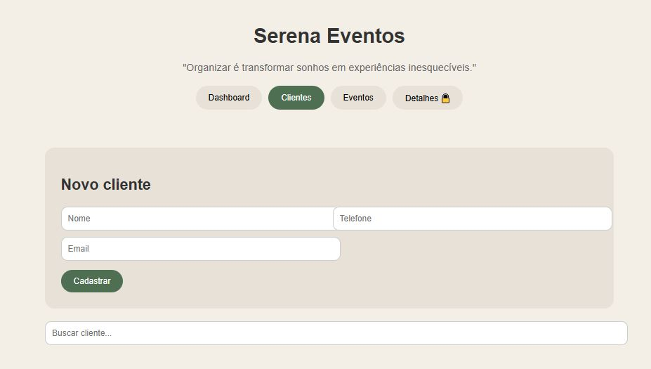
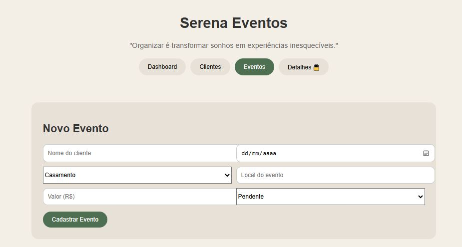
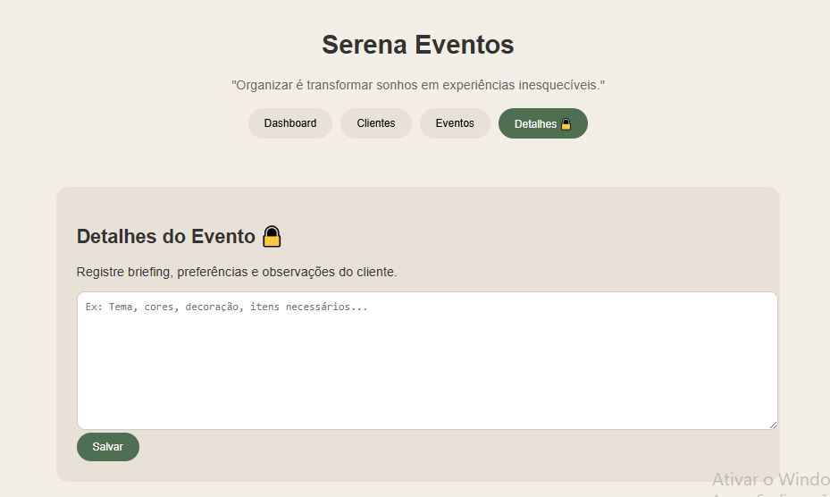

# Serena Eventos

Sistema web simples de gestão de eventos, desenvolvido como projeto de extensão do curso de Análise e Desenvolvimento de Sistemas.

O sistema foi pensado para profissionais que atuam com organização, decoração e planejamento de eventos, permitindo o controle de clientes e agendamentos de forma prática e intuitiva. Ele funciona como um "mini CRM" para facilitar a gestão organizacional.

---
## Acesse o projeto

  <a href>="https://serenaagenda.netlify.app/">
     <strong> Acessar Sistema Online</
strong>
  </a>

## Preview do Sistema

### Início

    

### Dashboard

    

### Clientes

    

### Eventos

    

### Detalhes

    

## Objetivo do Projeto

Desenvolver uma aplicação web funcional que auxilie na organização de eventos, proporcionando:

- Cadastro de clientes
- Controle de agenda
- Visualização de eventos
- Registro de informações importantes

---

## Funcionalidades

- Login simples para acesso ao sistema (modo demonstrativo)
- Cadastro de clientes
- Busca de clientes por nome
- Agendamento de eventos
- Listagem de eventos cadastrados
- Dashboard com indicadores básicos:
  - Eventos na semana
  - Eventos no mês
  - Total de clientes
- Área de anotações para detalhes dos eventos (briefing/detalhes)

---

## Tecnologias Utilizadas

- HTML5
- CSS3
- JavaScript (Vanilla)
- LocalStorage (armazenamento no navegador)

---
## Contribuição com os objetivos de Desenvolvimento Sustentável (ODS)

Este projeto está alinhado com o **ODS - Trabalho Decente e Crescimento Econômico**, 
que tem como objetivo promover o crescimento econômico sustentável, inclusivo e produtivo, 
além de garantir um trabalho decente para todos.
A aplicação contribui oferecendo uma solução simpls de gestão  para profissionais autônomos
e pequenos empreendedores do setor de festas e eventos, auxiliando no controle da agenda e planejamento
de atividades.

## Gargalo Identificado

Pequenos empreendedores do setor de festas e eventos vivenciam dificuldades na organização, gestão e
controles de clientes, datas e informações importantes, utilizando muitas vezes anotações informais e 
ferramentas não integradas.
Essa deficiência de gestão estruturada pode gerar perda de informações, conflitos de agenda, redução
na produtividade e impacto direto na qualidade do serviço prestado.

## Solução Proposta

O sistema Serena Agenda foi desenvolvida para centralizar e organizar essas informações, oferecendo uma
forma simples e acessível de gerernciar clientes e eventos, auxiliando os profissionais da aérea a atuarem de forma estratégica.

## Aplicação e relação com o os Objetivos Sustentáveis (ODS)

O projeto se alinha com o **ODS - Trabalho Descente e Crescimeto Econômico** apoiando pequenos empreendedores na melhoria da sua gestão organizacional, e promovendo crescimento a partir da produtividade e alavancando em seu potencial econômico.

## 💻 Como Executar o Projeto

### Opção 1: Abrir diretamente
Abra o arquivo:

# index.html

em qualquer navegador.

---

### Opção 2: Usar Live Server (recomendado)

No terminal, dentro da pasta do projeto:

npx live-server

A aplicação será iniciada automaticamente no navegador.

---

## Dados de Teste

O sistema permite a criação manual de dados.

Também é possível adaptar o projeto para gerar dados simulados para testes e demonstrações.

---

## Armazenamento de Dados

Os dados são armazenados utilizando o `localStorage` do navegador.

Isso significa que:

- Os dados permanecem salvos mesmo após fechar a página
- Não há necessidade de banco de dados externo

---

## Observações sobre Segurança

Este projeto possui autenticação apenas para fins demonstrativos.

- Não há validação real de usuário e senha
- Não deve ser utilizado em produção sem melhorias de segurança

---

## Possíveis Evoluções Futuras

O projeto pode ser expandido com diversas melhorias, como:

- Integração com Google Agenda
- Integração com Google Sheets (backup de dados)
- Implementação de banco de dados (Firebase, MongoDB, etc.)
- Sistema de autenticação real
- Dashboard com gráficos interativos
- Controle financeiro de eventos
- Exportação de relatórios (PDF/Excel)
- Responsividade avançada para dispositivos móveis
- Deploy com domínio personalizado

---

## Aplicabilidade

Este sistema pode ser utilizado por:

- Organizadores de eventos
- Decoradores
- Profissionais autônomos
- Pequenos empreendedores

---

## Autora

Desenvolvido por **Brenda Leite**  
Projeto acadêmico com foco em prática e aplicação real de conceitos de desenvolvimento web.

---

## Status do Projeto

Em desenvolvimento e evolução contínua.

---

## 🔗 Considerações Finais

Este projeto representa a aplicação prática de conhecimentos em desenvolvimento web, com foco em resolução de problemas reais e criação de soluções simples, funcionais e escaláveis.

